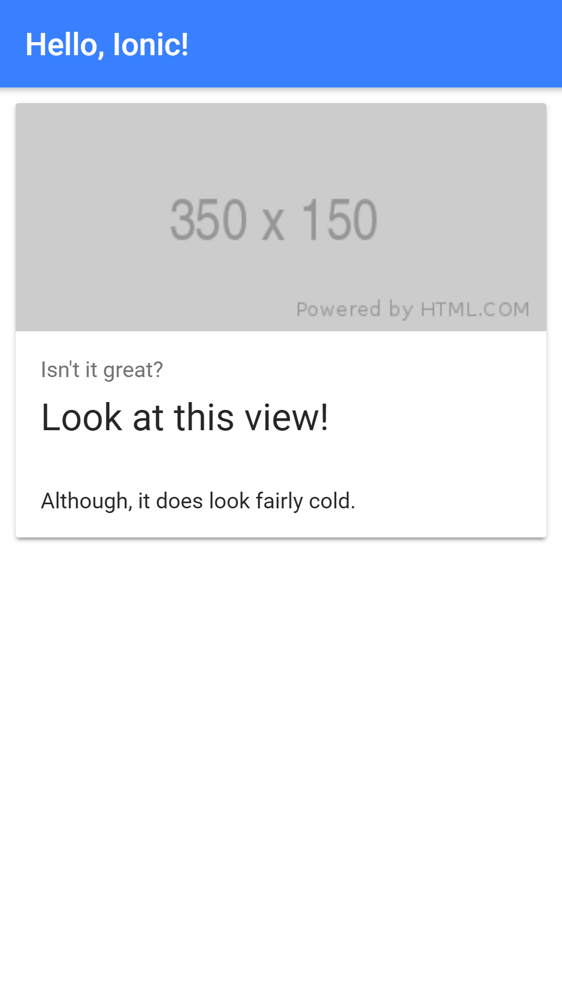

# ionic-vue [Ionic 4: Angular, Vue.js](https://ionicworkshop.com/posts/introduction-to-ionic-framework-angular-vue-react/#vuejs).

## Project setup
```
# Start a new Ionic and Angular project based on the blank template
$ ionic start ionic-angular blank

> don't install AppFlow at this stage

# Change directory
$ cd ionic-angular

# Run the project
$ npm run serve
```

## App Preview

All app preview screenshots were taken by running `npm run serve` on a retina display.

  


### Compiles and hot-reloads for development
```
npm run serve
```

### Compiles and minifies for production
```
npm run build
```

### Run your tests
```
npm run test
```

### Lints and fixes files
```
npm run lint
```

### Customize configuration
See [Configuration Reference](https://cli.vuejs.org/config/).
